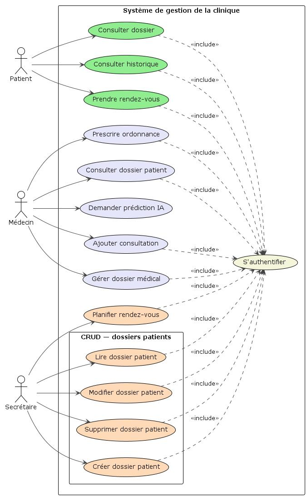
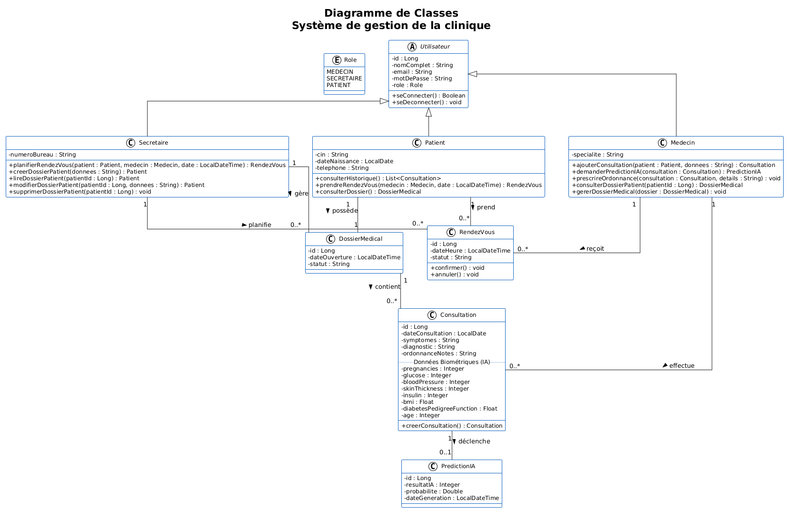
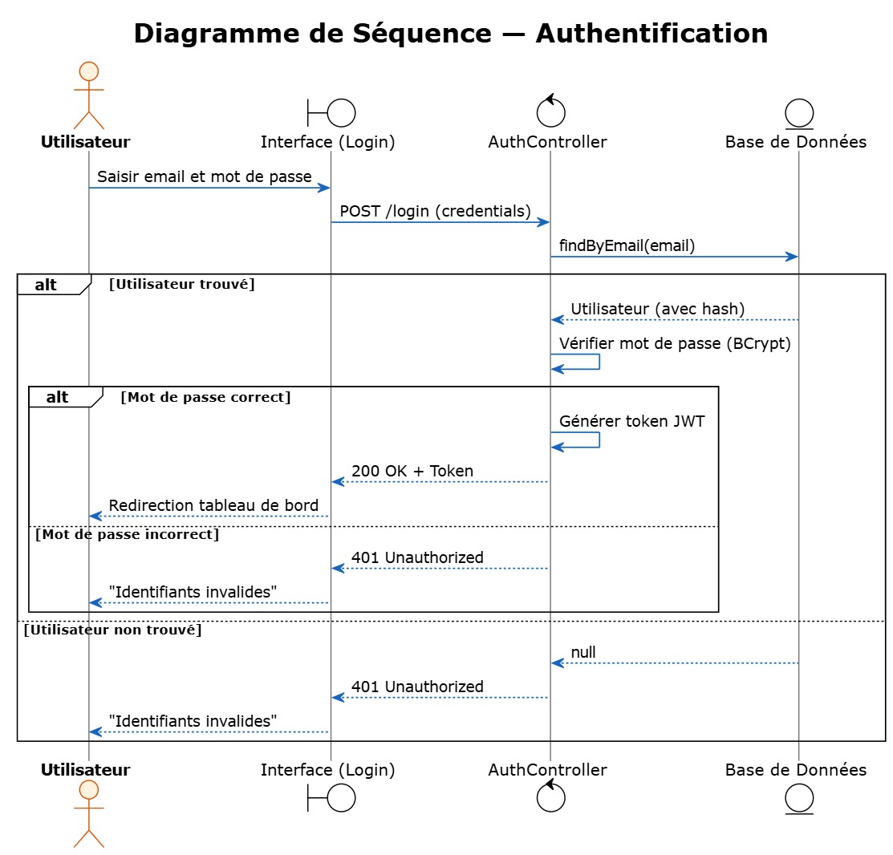
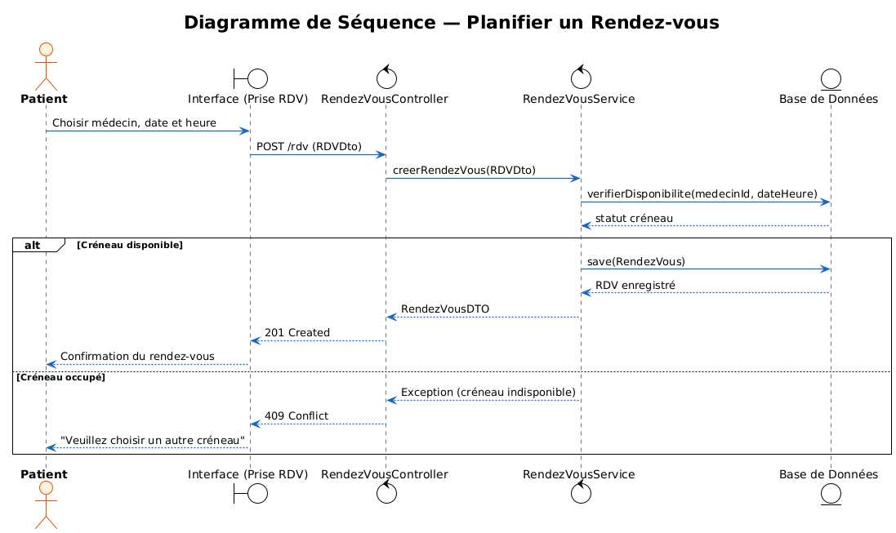
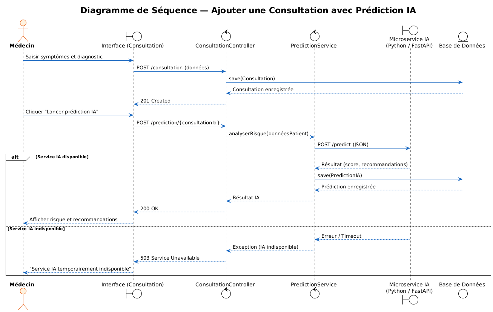

# Système de Gestion des Dossiers Médicaux : Application des modèles d’IA

Ce projet est développé dans le cadre du Projet de Fin d'Année (PFA). Il vise à moderniser la gestion d'une clinique en intégrant un système de prise de rendez-vous, un suivi des dossiers médicaux, et un module d'Intelligence Artificielle pour l'aide au diagnostic.

## 🏗️ Architecture et Conception UML

Afin de garantir une base solide pour le développement avec Spring Boot et FastAPI, le système a été modélisé selon l'approche orientée objet.

### 1. Diagramme des Cas d'Utilisation
Ce diagramme illustre les interactions des trois acteurs principaux (Médecin, Secrétaire, Patient) avec le système.

### 2. Diagramme de Classes
L'architecture statique du système, mettant en évidence l'entité centrale `Consultation` et son lien avec le module `PredictionIA`.

### 3. Diagrammes de Séquence

#### Scénario 1 : Authentification

#### Scénario 2 : Planification d'un rendez-vous

#### Scénario 3 : Ajout d'une consultation et appel au modèle d'IA
Ce scénario montre l'interaction asynchrone entre le Backend principal et le Microservice IA.

---
*Projet développé par Mohamed Khalil IBOUCHNA.*